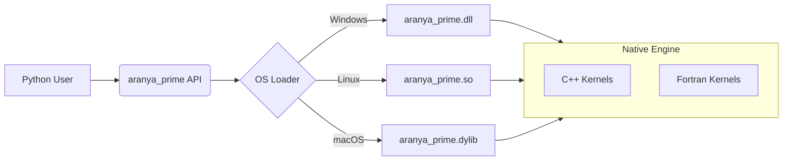

# Aranya Prime (v0.1 alpha)

[](https://colab.research.google.com/github/Adi-Baba/Aranya_Prime/blob/main/demo.ipynb)


**"Optimization Collapse" for High-Performance Computing.**

Aranya Prime is a modular, cross-platform computation engine designed to solve the "Entropy Reduction" problem. It replaces dynamic Python interpretation with statically compiled, highly-optimized "Fused kernels" written in **C++**, **Fortran**, and **V**.

---

## 🚀 Key Features

*   **Native Performance:** Compiles to a single shared library (`.dll`, `.so`, `.dylib`) natively on Windows, Linux, and macOS.
*   **Zero-Copy:** Operates directly on NumPy memory buffers without serialization.
*   **Polyglot Logic:**
    *   **C++ (OpenMP):** Best for complex logic, fused loops (Trig, Transforms).
    *   **Fortran (BLAS):** Best for raw array mathematics.
*   **Standard Architecture:** No magic JIT or hidden cache folders. You own the `src/` code.

---

## 🏗️ Architecture



---

## 📊 Benchmarks (10 Million Rows)

| Operation | Speedup vs NumPy | Status |
| :--- | :--- | :--- |
| **Rotate 2D** | **~6.7x** | 🚀 Massive |
| **Trigonometry** | **~1.5x - 3.5x** | ✅ Faster |
| **Transforms** | **~2.6x** | ✅ Faster |
| **Array Ops** | **~1.2x - 1.4x** | ✅ Saturated |
| **Dot Product** | **~1.6x** | ✅ Faster |

*(Benchmarks are dynamic and hardware-dependent. Tested on Intel Core i7 / AVX2 enabled)*

---

## ⚡ Quick Start: Google Colab / Linux

### Option 1: Pip Install from GitHub (Recommended)
This is the easiest way to install Aranya Prime. It will automatically compile the native kernels for your OS.

**Prerequisites:**
*   **Linux**: `sudo apt install g++ gfortran`
*   **Colab**: Pre-installed.
*   **Windows**: See "Local Installation" below.

```bash
pip install git+https://github.com/Adi-Baba/Aranya_Prime.git
```

### Option 2: Clone and Build

1.  **Clone the Repository**
    ```bash
    git clone https://github.com/Adi-Baba/Aranya_Prime.git
    cd Aranya_Prime
    ```

2.  **Install**
    ```bash
    pip install .
    ```

3.  **Run the Demo**
    ```python
    import numpy as np
    import aranya_prime as ap

    # Create Data
    N = 10_000_000
    x = np.random.rand(N)
    y = np.random.rand(N)
    angle = 0.785 # 45 degrees

    # 1. Faster Trigonometry
    res_sin = ap.sin(x) 

    # 2. ~7x Faster Rotation (Kernel Fusion)
    rx, ry = ap.rotate_2d(x, y, angle)

    print("Success! Aranya Prime is running.")
    ```

---

## 🛠️ Local Installation

### Prerequisites (Critical)
Aranya Prime compiles native code on your machine. You **MUST** have C++ and Fortran compilers installed.

#### Windows
1.  **Install MSYS2**: Download from [msys2.org](https://www.msys2.org/).
2.  **Install Toolchain**: Open MSYS2 terminal and run:
    ```bash
    pacman -S mingw-w64-x86_64-gcc mingw-w64-x86_64-gcc-fortran
    ```
3.  **Add to PATH**: Add `C:\msys64\mingw64\bin` to your System PATH environment variable.
4.  **Verify**: Open PowerShell and check:
    ```powershell
    g++ --version
    gfortran --version
    ```

#### Linux (Debian/Ubuntu)
```bash
sudo apt update
sudo apt install build-essential gfortran
```

#### macOS
```bash
brew install gcc
```

### Install Command
Once pre-requisites are met:
```bash
pip install git+https://github.com/Adi-Baba/Aranya_Prime.git
```

---

## ❓ Troubleshooting

### "C++ compiler not found"
**Cause:** You are installing from source (git/tarball) but don't have a C++ compiler.
**Fix:** 
1.  **Recommended:** Wait for the binary wheels (pre-built packages) to be available on PyPI.
2.  **Immediate:** Install `g++` (Linux) or `MinGW` (Windows) as described in Prerequisites.

### "Fortran compiler not found" (Warning)
**Cause:** You don't have `gfortran`.
**Effect:** The installation will **succeed**, but high-performance BLAS kernels (e.g. Matrix Multiplication) will be disabled or fall back to slower implementations.
**Fix:** Install `gfortran` to enable full performance.

### "Release 0.1.0a1 not found"
**Cause:** You might be trying to pip install the package name before it's uploaded to PyPI.
**Fix:** Use the `git+https...` command.

---

## 🧠 The Philosophy (OIH)
Aranya Prime is built on the **Ontological Information Hypothesis (OIH)**.
*   **Entropy Reduction:** Python code has high entropy (many possible states/types). Compiled C++ has low entropy (fixed types/instructions).
*   **Optimization Collapse:** By collapsing the high-entropy Python loop into a single low-entropy C++ instruction stream, we reclaim the latent computational power of the hardware.

---
*Aranya Research / Aditya*
