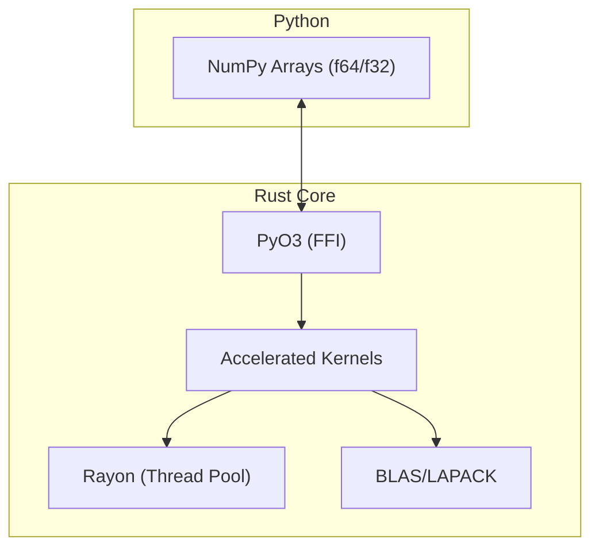

# Aranya Prime

Aranya Prime is a high-performance computation engine for Python, written in Rust. It provides optimized kernels for numerical operations, leveraging **PyO3** for zero-copy NumPy integration and **Rayon** for parallel execution.

For heavy linear algebra tasks, it can also dispatch to **BLAS/LAPACK** via Fortran FFI.

## Architecture


```mermaid
graph TD
    subgraph Python
        NumPy["NumPy Arrays (f64/f32)"]
    end

    subgraph "Rust Core"
        PyO3["PyO3 (FFI)"]
        Rayon["Rayon (Thread Pool)"]
        Linalg["Accelerated Kernels"]
        BLAS["BLAS/LAPACK"]
    end

    NumPy <--> PyO3
    PyO3 --> Linalg
    Linalg --> Rayon
    Linalg --> BLAS
```

## Key Features

- **Zero-Copy Interop:** Directly mutates and reads NumPy memory buffers.
- **Parallel Reductions:** Multi-threaded implementations of sum, mean, std, and norms.
- **Advanced Transforms:** Parallel FFT (via `rustfft`) and DCT.
- **Fast-Math:** Native `f32` variants for high-throughput, lower-precision workloads.
- **Streaming:** Chunked kernels for processing arrays larger than CPU cache/RAM.

## Installation

Requires a Rust toolchain to build from source.

```bash
pip install .
```

For development:
```bash
maturin develop
```

## Performance

Aranya Prime is designed to outperform NumPy for operations where parallel overhead is offset by computation intensity (e.g., large-scale matrix multiplication or signal processing).

### Benchmarking
Run the included benchmark suite:
```bash
pytest --benchmark-only
```

## Development Status

- [x] Phase 1: Core hardening (Sum, Mean, Clip, Norms)
- [x] Phase 2: Signal Processing (FFT, DCT)
- [x] Phase 3: Linear Algebra (MatMul, SVD, Dot)
- [x] Phase 4: f32 optimization & Streaming
- [ ] Phase 5: CI/CD & Multi-platform wheels
