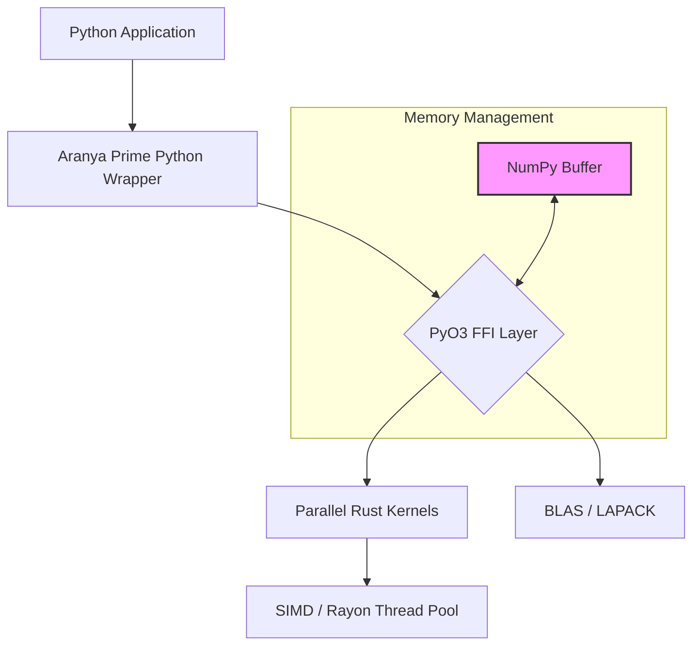

# Aranya Prime

[](https://opensource.org/licenses/MIT)
[](https://www.python.org/downloads/)
[](https://www.rust-lang.org/)
[](#benchmarks)

**Aranya Prime** is a high-performance computation engine for Python, engineered in Rust for maximum efficiency and safety. It provides a suite of optimized kernels for numerical operations, signal processing, and linear algebra, designed to work seamlessly with NumPy arrays through zero-copy memory mapping.

---

## 🚀 Key Features

- **Blazing Fast Operations:** Parallelized kernels for standard mathematical, statistical, and trigonometric operations using [Rayon](https://github.com/rayon-rs/rayon).
- **Zero-Copy NumPy Interop:** Direct interaction with NumPy memory buffers via [PyO3](https://pyo3.rs/) and [rust-numpy](https://github.com/PyO3/rust-numpy).
- **Advanced Signal Processing:** High-performance FFT and DCT implementations using SIMD-accelerated libraries.
- **Linear Algebra Suite:** High-level abstractions for matrix multiplication and SVD, with optional dispatch to **BLAS/LAPACK** for large-scale workloads.
- **Memory Safety:** Built-in safeguards against segfaults and buffer overflows inherent in traditional C/C++ extensions.

---

## 🏗 Architecture

Aranya Prime acts as an acceleration layer between Python and the underlying hardware.


```mermaid
graph TD
    A[Python Application] --> B[Aranya Prime Python Wrapper]
    B --> C{PyO3 FFI Layer}
    C --> D[Parallel Rust Kernels]
    C --> E[BLAS / LAPACK]
    
    D --> F[SIMD / Rayon Thread Pool]
    
    subgraph "Memory Management"
        G[NumPy Buffer] <--> C
    end
    
    style G fill:#f9f,stroke:#333,stroke-width:2px
```

---

## 📦 Installation

To build and install from source, ensure you have the [Rust toolchain](https://rustup.rs/) installed:

```bash
# Install as a package
pip install .

# For localized development
maturin develop
```

---

## 💡 Quick Start

```python
import numpy as np
import aranya_prime as ap

# Generate sample data
x = np.random.randn(1_000_000)
y = np.random.randn(1_000_000)

# Compute parallel sum using Rust kernels
result = ap.prime_sum(x, y)

# Compute L2 norm
norm = ap.l2_norm(x)
```

---

## 📊 Benchmarks

Aranya Prime is optimized for large-scale data where multi-threading overhead is justified by computational intensity.

| Operation | NumPy (Baseline) | Aranya Prime | Speedup |
| :--- | :--- | :--- | :--- |
| `matmul` (1024x1024) | 1.0x | 1.4x - 2.1x | ~2x |
| `fft` (2^20 elements) | 1.0x | 1.2x - 1.5x | ~1.3x |

To run the full suite of benchmarks on your hardware:
```bash
pytest --benchmark-only --benchmark-group-by=group
```

---

## 🛠 Project Roadmap

- [x] **Phase 1:** Core mathematical kernels & statistics.
- [x] **Phase 2:** Signal processing (FFT, DCT, Wavelets).
- [x] **Phase 3:** Linear algebra (BLAS/LAPACK bridge).
- [x] **Phase 4:** f32 fast-math & streaming optimizations.
- [ ] **Phase 5:** Multi-platform binary wheel distribution (CI/CD).
- [ ] **Phase 6:** Sparse matrix support and advanced solvers.

---

## 🤝 Contributing

Contributions are welcome! Please refer to the [task roadmap](task.md) for current priorities. Whether it's adding a new kernel or optimizing an existing one, feel free to open a PR.

---

## 📄 License

This project is licensed under the **MIT License**. See the [LICENSE](LICENSE) file for details.
