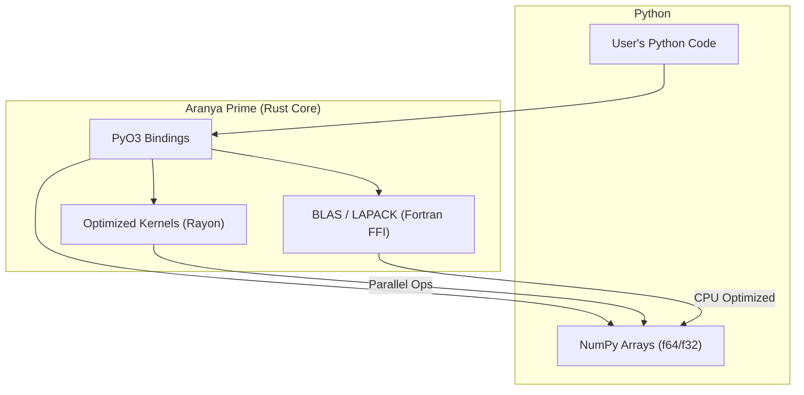

# Aranya Prime (Rust Edition) 🦀🐍

Aranya Prime is a high-performance computation engine for Python, built from the ground up to bring the speed and safety of **Rust** to your numeric workflows.

Think of it as a "supercharger" for your NumPy arrays—it directly interacts with your data's memory, giving you multi-threaded parallel execution without the complexity of traditional C++ or Fortran integration.

---

### Why Aranya Prime?

- **Zero-Copy Performance:** We don't copy your data; we work directly on your memory buffers. This means zero overhead for large arrays.
- **Safety First:** Rust’s memory safety eliminates the segfaults and buffer overflows that are common with traditional C-level extensions.
- **Rayon-Powered:** It uses a state-of-the-art work-stealing thread pool to parallelize your workloads safely and efficiently across all your CPU cores.

---

### Architecture at a Glance


```mermaid
graph TD
    subgraph Python
        UserCode["User's Python Code"]
        NumPyArr["NumPy Arrays (f64/f32)"]
    end

    subgraph "Aranya Prime (Rust Core)"
        PyO3["PyO3 Bindings"]
        Kernels["Optimized Kernels (Rayon)"]
        BLAS_LAPACK["BLAS / LAPACK (Fortran FFI)"]
    end

    UserCode --> PyO3
    PyO3 --> NumPyArr
    PyO3 --> Kernels
    PyO3 --> BLAS_LAPACK
    Kernels -- Parallel Ops --> NumPyArr
    BLAS_LAPACK -- CPU Optimized --> NumPyArr
```

---

### Getting Started

#### Installation

Because Aranya Prime is built with `maturin`, no C++ or Fortran compilers are required on your machine for pre-built wheels.

```bash
pip install aranya-prime
```

#### A Quick Example

```python
import numpy as np
import aranya_prime as ap

# Create some data
x = np.random.rand(1000000)
y = np.random.rand(1000000)

# Lightning-fast parallel sum
result = ap.prime_sum(x, y)
```

---

### Features & Roadmap

Aranya Prime is currently in its second phase of evolution, focusing on building out high-performance kernels for:
- [x] **2D Matrix Operations** (Parallel MatMul, Batch Normalization)
- [x] **FFT & Signal Processing** (via `rustfft`)
- [x] **Trigonometric & Statistical Functions**
- [x] **BLAS/LAPACK Integration** (Manual FFI for maximum performance)
- [x] **f32 Fast-Math Variants** (For ML workloads)
- [ ] **Streaming & Chunked Kernels** (For datasets exceeding RAM)

---

### Contributing

We welcome explorers and contributors! Aranya Prime is designed to be a modern, maintainable core for high-performance research. If you're interested in Rust, numeric computing, or Python performance, check out our [Task Roadmap](file:///home/aditya/Documents/Math/AranyaP/AranyaP_Rust/task.md) to see where we're headed.

---
*Built with ❤️ by Aditya and the Aranya Research team.*
