# Aranya Prime (v0.1 alpha)

[](https://colab.research.google.com/github/Adi-Baba/Aranya_Prime/blob/main/demo.ipynb)


**"Optimization Collapse" for High-Performance Computing.**

Aranya Prime is a modular, cross-platform computation engine designed to solve the "Entropy Reduction" problem. It replaces dynamic Python interpretation with statically compiled, highly-optimized "Fused kernels" written in **C++**, **Fortran**, and **V**.

---

## 🚀 Key Features

*   **Native Performance:** Compiles to a single shared library (`.dll`, `.so`, `.dylib`) natively on Windows, Linux, and macOS.
*   **Zero-Copy:** Operates directly on NumPy memory buffers without serialization.
*   **Polyglot Logic:**
    *   **C++ (OpenMP):** Best for complex logic, fused loops (Trig, Transforms).
    *   **Fortran (BLAS):** Best for raw array mathematics.
*   **Standard Architecture:** No magic JIT or hidden cache folders. You own the `src/` code.

---

## 🏗️ Architecture

```mermaid
graph LR
    User[Python User] --> Wrapper(aranya_prime Wrapper)
    Wrapper --> Loader{OS Loader}
    Loader -- Windows --> Win[aranya_prime.dll]
    Loader -- Linux --> Lin[aranya_prime.so]
    Loader -- macOS --> Mac[aranya_prime.dylib]
    Win --> Kernels
    Lin --> Kernels
    Mac --> Kernels
    subgraph Kernels [Native Engine]
        CPP[C++ Kernels]
        F90[Fortran Kernels]
    end
```



---

## 📊 Benchmarks (10 Million Rows)

| Operation | Speedup vs NumPy | Status |
| :--- | :--- | :--- |
| **Rotate 2D** | **~6.7x** | 🚀 Massive |
| **Trigonometry** | **~1.5x - 3.5x** | ✅ Faster |
| **Transforms** | **~2.6x** | ✅ Faster |
| **Array Ops** | **~1.2x - 1.4x** | ✅ Saturated |
| **Dot Product** | **~1.6x** | ✅ Faster |

*(Benchmarks are dynamic and hardware-dependent. Tested on Intel Core i7 / AVX2 enabled)*

---

## ⚡ Quick Start: Google Colab / Linux

### Option 1: Pip Install from GitHub
```bash
pip install .
```
*(This automatically compiles native kernels on your machine)*

### Option 2: Clone and Build

1.  **Clone the Repository**
    ```bash
    git clone https://github.com/Adi-Baba/Aranya_Prime.git
    cd Aranya_Prime
    ```

2.  **Install**
    ```bash
    pip install .
    ```

3.  **Run the Demo**
    ```python
    import sys
    import os
    import numpy as np
    
    # Add to path
    sys.path.append(os.getcwd())
    from aranya_prime import wrapper

    # Create Data
    N = 10_000_000
    x = np.random.rand(N)
    y = np.random.rand(N)
    angle = 0.785 # 45 degrees

    # 1. Faster Trigonometry
    res_sin = wrapper.sin(x) 

    # 2. ~7x Faster Rotation (Kernel Fusion)
    rx, ry = wrapper.rotate_2d(x, y, angle)

    print("Success! Aranya Prime is running.")
    ```

---

## 🛠️ Local Installation

### Prerequisites
*   `python` (3.9+)
*   **Windows**: MinGW-w64 (`g++`, `gfortran`) added to PATH.
*   **Linux/Mac**: `gcc`, `gfortran` (Standard install).

### Install Command
```bash
pip install .
```
*This detects your OS, compiles the C++/Fortran kernels, and installs the package.*

---

## 🧠 The Philosophy (OIH)
Aranya Prime is built on the **Ontological Information Hypothesis (OIH)**.
*   **Entropy Reduction:** Python code has high entropy (many possible states/types). Compiled C++ has low entropy (fixed types/instructions).
*   **Optimization Collapse:** By collapsing the high-entropy Python loop into a single low-entropy C++ instruction stream, we reclaim the latent computational power of the hardware.

---
*Aranya Research / Aditya*
